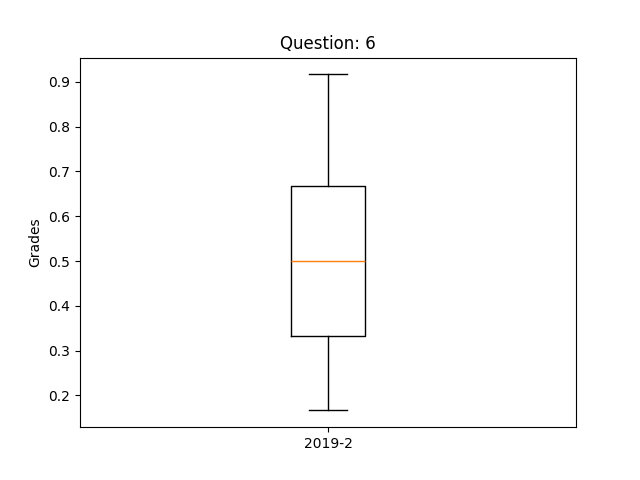
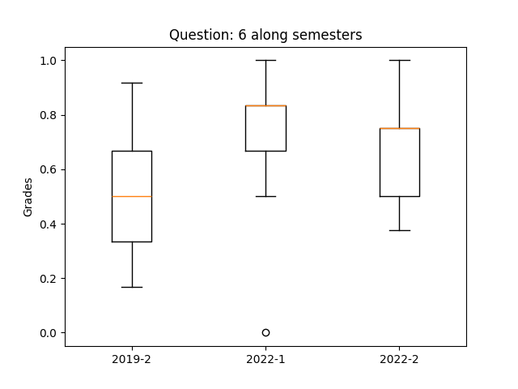
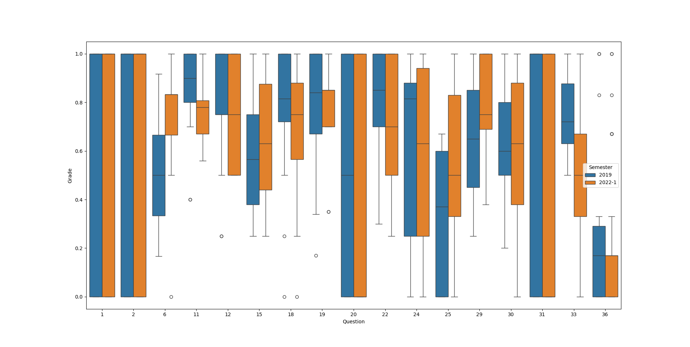

# Student Performance before and after COVID-19
## Abstract
Several pandemics have occurred in human history and affected the human life, such as education and economy. The COVID-19 pandemic has had an unprecedented and widespread impact on education, significantly affecting students worldwide. Thus, the aim of this study is to evaluate the impact of the pandemic on student performance, especially in the Software Engineering discipline. We collected historical data from Software Engineering students over the last five years, such as their grades in a set of repeated questions throughout the semesters. As one of our results, we identified that the pandemic negatively influenced student performance in 2022, especially in the first semester. However, we also observed that the impact was mitigated in the following semesters.

# GitHub Project
This GitHub project is a Python language with a five-layer architecture implementation and MySQL connection. The database model used is explained in Elmashi and Navathe's book, "Introduction to Database Fundamentals, 7th edition." The goal of this job is show our data and analysis. You can reply or understand our research following or reading the next steps.

## Start environment
After cloning the repository and entering the main folder, start an environment with Python 3.12.3 installed and execute the following steps:
1. Creates an envpreposcovid folder
```bash
python -m venv envPrePosCovid
```
2. Into envpreposcovid folder create a private.py with your MySQL connecting credentials, for example:
```bash
HOST = "localhost"
USER = "root"
PASSWORD = "ibd2024"
```
3. Activat the python's environment
```bash
.\envPrePosCovid\Scripts\activate
```
4. Install the libraries
```bash
pip install -r doc/requirements.txt
```
5. Into a MySQL execute the file database/sql/createSquema.sql to start a preposcovid database

6. Finally execute the app:
```bash
python app.py
```

## Application
When execute the aplication a menu appear with the following options:

```bash
---------------------Welcome--------------------------------
1. Example boxplot question and class: (question=6, class='2019-2')
2. Example boxplot question in all classes: (question=6)
3. Figure 2: Common questions analyzed during the semesters in 2019 (prepandemic) and 2022-1 (post-pandemic)
0. Exit
---------------------Student Performance---------------------
```

The question six and class 2019-2 were used to genearate a boxplot with student performance performance. 

The statement of question 6 was ...

The funtionalite number 1 is from the tuple bellow with an array of 36 student's grade.
```
(	
  Question = 6,
  Semester = '2019-2',
  grades = [0.33, 0.5, 0.33, 0.17, 0.5, 0.67, 0.667, 0.67, 0.5, 0.33, 0.67, 0.33, 0.67, 0.83, 0.33, 0.5, 0.33, 0.33, 0.33, 0.33, 0.83, 0.83, 0.5, 0.5, 0.33, 0.5, 0.92, 0.17, 0.83, 0.5, 0.17, 0.83, 0.33, 0.92, 0.33, 0.83]
);
```
And the boxplot result was:



To have a vision along the time the functionalite 2 performance of the students in all semester that the question was applied. 






